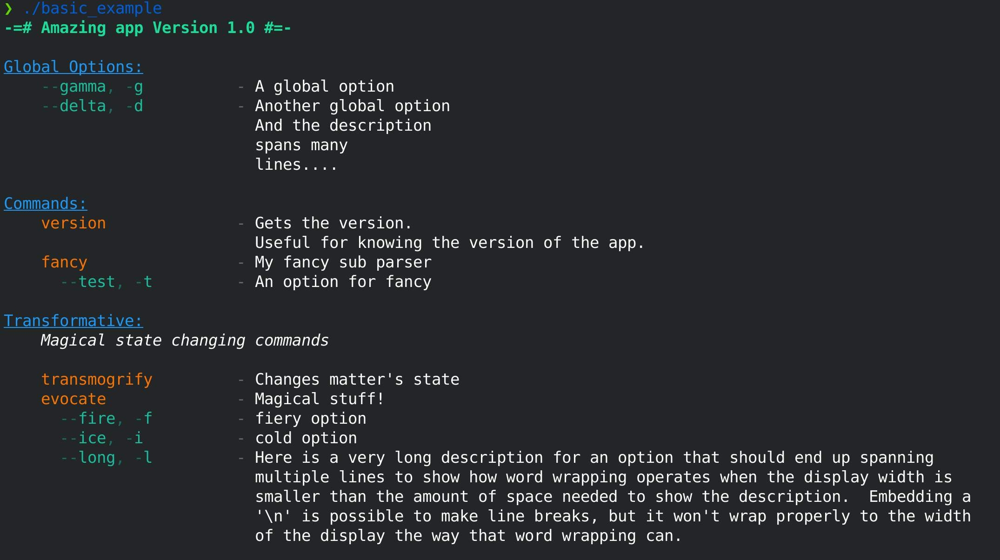

A C++ option parser that handles global options, options with parameters, and sub-commands with command specific options as well.

# Quick Example

To use argunaught, you create a Parser object and define global options and any subcommands, which can have their own command specific options.

```cpp
auto args = argunaught::Parser("Cool Test App")
    .options({
        {"gamma", "g", "A global option", 1},
        {"delta", "d", "Another global option", 0}
    })
    .command(
        "version", "Gets the version.", [] (auto& parseResult) -> int 
        { 
            printf("Version: 1\n"); 
            return 0;
        }
    )
    .command(
        "sub", "An awesome sub-command.",
        {
            {"test", "t", "A test option.", 0},
            {"alpha", "a", "cool option", -1},
            {"beta", "b", "cool other option", 2}
        },
        [] (auto& parseResult) -> int 
        { 
            /*argunaught::opt("h", "help")*/ 
            return 0;
        } 
    );
```

You can then parse your command line arguments with 

```
auto parseResult = args.parse(argc, argv);
```

and can use the returned `ParseResult` to see what options were found, their parameters, if any subcommand was used and also get any positional arguments.

## Running a sub-command

You can check if a subcommand was found, and run it with:

```cpp
if(parseResult.hasCommand()) {
    parseResult.runCommand();
}
```

The sub-command will be provided the `ParseResult` so it can look at parameters and options on its own.  It will contain any global options found as well as any command specific options that were found.

You can look at options that were parsed results (including their parameters) in the `ParseResult::options` vector of `OptionResult`s:

```cpp
parseResult.options[ii];
```

Finally, you can also see any positional arguments with:

```cpp
parseResult.positionalArgs[ii]
```

## Option paramters

Options can take parameters as seen above with `-g` taking 1 parameter.  You can also define an option to take an unknown number of parameters with `-1`.  These option parameters are read up to the next option or in the case of it being the last option before positional arguments, before a standalone `--`. 

Therefore, positional arguments start once the last option's parameters are full or with a separate `--` to mark the end of options.  E.g. `my_tool sub -a blah -- one two three` would count `one`, `two`, and `three` as positonal arguments even if the `-a` option takes an unknown number of arguments itself.

# Subparsers

In some cases, you want to have a top level command as a sematic grouping that leads to its own parsing environment.  This can for example enable `conan` like syntax, where a command like `remote` then has its own sub commands like `list`, `add`, `remove`, etc.

Subparsers are effectively fancy commands that have a different handler function.  During parsing, if a subparser command is found, the parser calls the subparsers handler, letting it return the final `ParseResult`.  It receives any options found so far, a reference to the parent parser to pull in global options in case any show up later and lastly the `std::deque` of arguments left to parse.

# Printing Help Text

There is built in support for printing out nice looking help text; formatting global options, commands and command specific options into sections.  You can create a `DefaultHelpFormatter` class, constructing it with the parser you want to generate help from.  It also accepts a style class, where you can modify the spacing and colors used in a tty terminal.

```
// Given args defined in the example above
auto helpFormatter = argunaught::DefaultHelpFormatter(args);
std::cout << helpFormatter.helpString();
```

## Command Groups

Many times you may have a number of commands that are logically different groups.  For instance, if you were creating a tool that has some generic commands like `version`, and `help`, but also has some special commands for performing magic, you might want the magic related commands to be grouped when printing out help.

Look at the example below for how a group can be created using the fluent interface method `Parser::group()`:

```cpp
auto args = argunaught::Parser("Cool Test App", "-=# Amazing app Version 1.0 #=-")
    .options({
        {"gamma", "g", "A global option", 1},
        {"delta", "d", "Another global option\nAnd the description\nspans many\nlines....", 0}
    })
    .command(
        "version", "Gets the version.\nUseful for knowing the version of the app.", [] (auto& parseResult) -> int 
        { 
            printf("Version: 1\n"); 
            return 0;
        }
    )
    .group("Transformative", "Magical state changing commands")
        .command("transmogrify", "Changes matter's state",
            [] (auto& parseResult) -> int 
            { 
                return 0;
            })
        .command("evocate", "Magical stuff!",
            {
                {"fire", "f", "fiery option", 0},
                {"ice", "i", "cold option", 0},
                {"long", "l",
                "Here is a very long description for an option "
                "that should end up spanning multiple lines to show "
                "how word wrapping operates when the display width "
                "is smaller than the amount of space needed to show "
                "the description.  Embedding a '\\n' is possible to "
                "make line breaks, but it won't wrap properly to the "
                "width of the display the way that word wrapping can.", 0}
            },
            [] (auto& parseResult) -> int 
            { 
                return 0;
            })
    .endGroup();

auto formatter = argunaught::DefaultHelpFormatter(args);
std::cout << formatter.helpString();
```

`Parser::group()` creates a new group with the parser with a name and optionally a description.  It returns a reference to the `CommandGroup` so that commands can be added to it.  To end the group, call `CommandGroup::endGroup` fluent method which just returns the parent `Parser` so that more global commands or options can be added.

## Description Formatting

In the example above, you can see the two features in option and command description formatting on display.  The help formatter will check the display size and take the minimum of that and the style's default max width to do word wrapping on the description, correctly indenting the new line.

New line charaters are also formatted and indentation handled correctly in description's for commands and options.

# A larger example

The parser setup in `basic_example` shows off all of the features of argunaught.  It contains global options, commands, grouped commands, and a subparser.  The definition of that parser looks like:

```cpp
auto args = argunaught::Parser("Cool Test App", "-=# Amazing app Version 1.0 #=-")
    .options({
        {"gamma", "g", "A global option", 1},
        {"delta", "d", "Another global option\nAnd the description\nspans many\nlines....", 0}
    })
    .command(
        "version", "Gets the version.\nUseful for knowing the version of the app.", [] (auto& parseResult) -> int 
        { 
            printf("Version: 1\n"); 
            return 0;
        }
    )
    .subParser("fancy", "My fancy sub parser",
        {{"test", "t", "An option for fancy"}},
        [&] (const auto& parser, auto optionResults, auto args) -> argunaught::ParseResult
        {
            argunaught::ParserPtr subParser = std::make_shared<argunaught::Parser>("Cool Test App - fancy");

            subParser->options(parser.options())
                .command("work", "sub parser command!", 
                    {},
                    [&] (auto& subParseResult) -> int 
                    {
                        printf("Did some work!\n");
                        return 0;
                    })
                .command("other", "sub parser other command!", 
                    {},
                    [&] (auto& subParseResult) -> int 
                    {
                        printf("Did some different work!\n");
                        return 0;
                    })
                .command("help", "Print fancy's help", 
                    {},
                    // Note we capture the shared pointer by value!
                    [subParser] (auto& subParseResult) -> int 
                    {
                        auto helpFormatter = argunaught::DefaultHelpFormatter(*subParser);
                        auto subHelp = helpFormatter.helpString();
                        printf("%s", subHelp.c_str());
                        return 0;
                    });

            auto result = subParser->parse(args, optionResults);

            // Set a default command if none was chosen. `help` in this case.
            if(!result.hasCommand()) {
                result.command = subParser->getCommand("help");
            }

            return result;
        }
    )
    .group("Transformative", "Magical state changing commands")
        .command("transmogrify", "Changes matter's state",
            [] (auto& parseResult) -> int 
            {
                printf("** Transmogrify!\n");
                return 0;
            })
        .command("evocate", "Magical stuff!",
            {
                {"fire", "f", "fiery option", 0},
                {"ice", "i", "cold option", 0},
                {"long", "l",
                "Here is a very long description for an option "
                "that should end up spanning multiple lines to show "
                "how word wrapping operates when the display width "
                "is smaller than the amount of space needed to show "
                "the description.  Embedding a '\\n' is possible to "
                "make line breaks, but it won't wrap properly to the "
                "width of the display the way that word wrapping can.", 0}
            },
            [] (auto& parseResult) -> int 
            {
                printf("** Evoke");
                if(parseResult.hasOption("fire")) {
                    printf(" FIRE");
                }
                if(parseResult.hasOption("ice")) {
                    printf(" ICE");
                }

                printf("!\n");
                return 0;
            })
    .endGroup();
```

One key point in using subparsers, is that you will want to create a shared pointer to the new parser and capture it by value in a command handler so that the parser can continue to exist once the sub parser handler returns.  If you create a parser as a normal object it will fall out of scope once the subparser handler returns and you can get a segfault.

The above parser's help text will look like:


